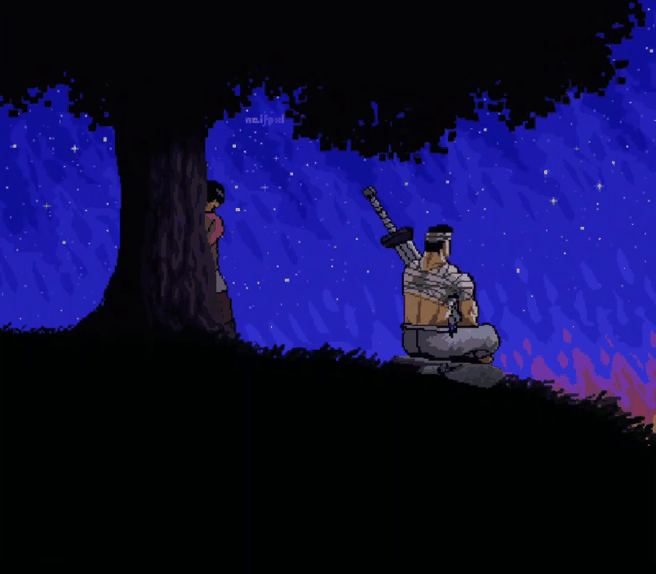

<div align="center">



<br>


<br>


<br>


</div>

---

# 🏆 Achievements

- 🥇 AI Ignite 2026 Finalist (SMVEC)
- 🥇 Hack India Spark 3 Hackathon 2026 Finalist (MEC)
- 💼 Data Science Intern @ OneYes Infotech Solutions
- 🚀 Co-Founder of Luna (Part of Taxina)

---

# 📌 About Me

- 🚀 Building real-world software solutions
- 💻 Passionate about Full Stack Development
- 🤖 Exploring Artificial Intelligence and Data Science
- 📚 Constantly improving problem-solving skills
- 🌱 Turning innovative ideas into impactful products
- 🎯 Preparing for top software engineering opportunities

---

# 🧠 Focus Areas

- 🌐 Web Development
- 📱 App Development
- 🤖 AI / Machine Learning
- 📊 Data Science
- ⚡ Backend Engineering

---

# 📊 GitHub Analytics

<div align="center">


</div>

<br>

<div align="center">


</div>

---

# 🏅 GitHub Trophies

<div align="center">


</div>

---

# 🛠 Tech Stack

## Programming Languages

<div align="center">


</div>

## Frontend Development

<div align="center">


</div>

## Backend Development

<div align="center">


</div>

## Database

<div align="center">


</div>

## Tools & Cloud

<div align="center">


</div>

---

# 📈 Most Used Languages

<div align="center">


</div>

---

# 🚀 Featured Projects

| Project | Description |
|-----------|------------|
| 🎯 IntentOS | AI-powered study workspace |
| 🩺 Symptom Triage Navigator | Healthcare guidance platform |
| 🧠 Attention Blackhole | Focus monitor web app |
| 🗺️ GeoPlanner AI | Intelligent location planner |
| 🌸 Sakura Cycle | Menstrual health awareness platform |
| 📚 Java FSE Solutions | Java practice repository |

---

# 🌐 Connect With Me

<div align="center">

<a href="https://www.linkedin.com/in/gokulsuresh11/">

</a>

<a href="mailto:gokulsuresh2808@gmail.com">

</a>

</div>

---

# 🐍 Contribution Snake

<div align="center">


</div>

---

# 🎮 Space Shooter Contribution Graph

<div align="center">


</div>

---

# 💡 Quote

<div align="center">

```text
"Dream big. Start small. Build consistently."

Every masterpiece begins with a single line of code.
```

</div>

---

<div align="center">


</div>
